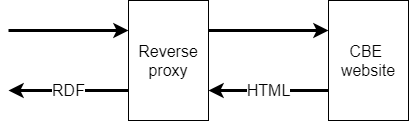

# HTML to RDF proxy


A simple reverse proxy for converting the output from the Belgian "Crossroad Bank Enterprises" company register into W3C ORG/ROV triples.

See also https://kbopub.economie.fgov.be/kbopub/zoeknaamfonetischform.html



## Example

Currently the conversion is very limited, e.g. the page https://kbopub.economie.fgov.be/kbopub/toonondernemingps.html?ondernemingsnummer=671516647 is turned into (N-Triples):

```
<https://org.belgif.be/id/cbe/org/0671_516_647> <http://www.w3.org/1999/02/22-rdf-syntax-ns#type> <http://www.w3.org/ns/org#Organization> .
<https://org.belgif.be/id/cbe/org/0671_516_647> <http://www.w3.org/1999/02/22-rdf-syntax-ns#type> <http://www.w3.org/ns/regorg#RegisteredOrganization> .
<https://org.belgif.be/id/cbe/org/0671_516_647> <http://www.w3.org/ns/regorg#legalName> "Service Public Fédéral Stratégie et Appui"@fr .
<https://org.belgif.be/id/cbe/org/0671_516_647> <http://www.w3.org/ns/regorg#legalName> "Föderaler Öffentlichter Dienst Politik und Unterstützung"@de .
<https://org.belgif.be/id/cbe/org/0671_516_647> <http://www.w3.org/ns/regorg#legalName> "Federale Overheidsdienst Beleid en Ondersteuning"@nl .
<https://org.belgif.be/id/cbe/org/0671_516_647> <http://www.w3.org/2004/02/skos/core#altLabel> "SPF BOSA"@fr .
<https://org.belgif.be/id/cbe/org/0671_516_647> <http://www.w3.org/2004/02/skos/core#altLabel> "FÖD BOSA"@de .
<https://org.belgif.be/id/cbe/org/0671_516_647> <http://www.w3.org/2004/02/skos/core#altLabel> "FOD BOSA"@nl .
<https://org.belgif.be/id/cbe/org/0671_516_647> <http://www.w3.org/ns/regorg#orgActivity> <https://vocab.belgif.be/auth/nace2008/84119> .
<https://org.belgif.be/id/cbe/org/0671_516_647> <http://www.w3.org/ns/regorg#orgActivity> <https://vocab.belgif.be/auth/nace2008/84111> .
<https://org.belgif.be/id/cbe/org/0671_516_647> <http://xmlns.com/foaf/0.1/homepage> <http://www.bosa.be> .
```


## Technical requirements

Java 11, uses Redhat Quarkus, JSoup and Eclipse RDF4J
